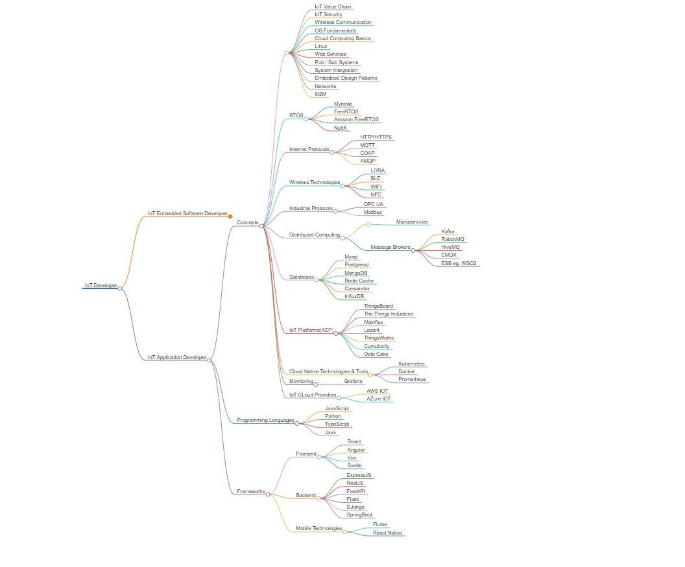
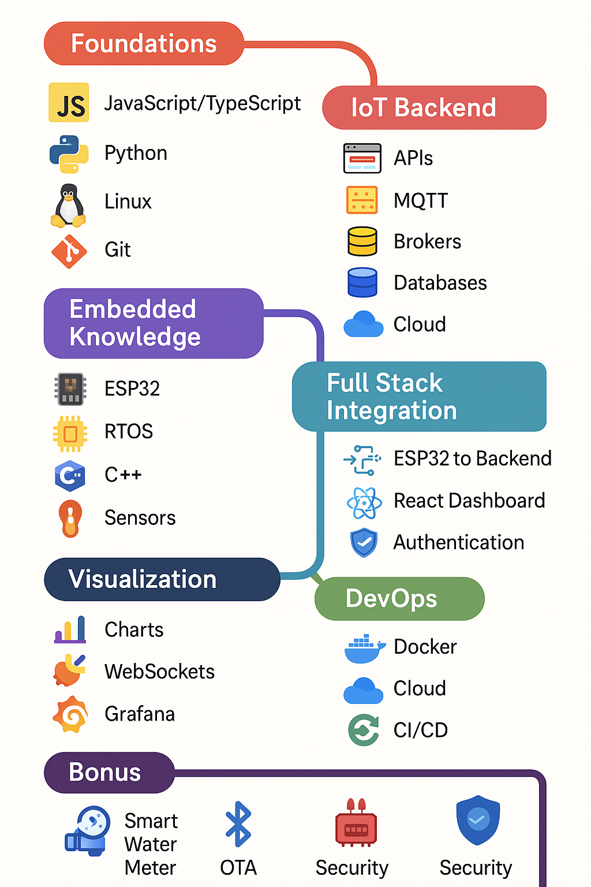

## IoT Application Developer 🛜
The roadmap is structured as follows
- General Skills
- custom roadmap for MERN and django
- Projects (suggested)

---

### 🤹🏿‍♂️ Introduction
For you to become an iot application developer you have to wear a lot of hats and be knowledgeable in a lot of things .

You should not think that you have to expert at all of these but at least have some idea on how to work with the following:
- Frontend
- Backend
- Cross Platform Mobile Development (Nice To have)

you can choose from the below frameworks whatever you feel comfortable working with or have worked with before.

## General Skills
- These are some of the general skills you need for you to advance to  the projects

### Programming Languages 💻:

- TypeScript
- JavaScript
- Python
- Java

### Frameworks
- The purpose of a framework is to provide a structured foundation and pre-written code that helps developers build applications faster, more efficiently, and with best practices already baked in.

#### Frontend
> choose one

- React
- Angular
- Vue
- Svelte

#### Backend
> choose one based on the language you are using

- ExpressJS
- NestJS
- FastAPI
- Flask
- DJango
- SpringBoot

#### Mobile Technologies

- Flutter
- React Native

### Concepts 🧠

- IoT Value Chain
- IoT Security
- Wireless Communication
- OS Fundamentals
- Cloud Computing Basics
- Linux
- Web Services
- Pub / Sub Systems
- System Integration
- Networks
- M2M
- Design Patterns

## 🧭 Custom IoT Developer Roadmap (for MERN + Django Devs)

### 🧱 Phase 1: Strengthen the Foundations (You likely know some of this)

- **JavaScript/TypeScript** – Deep dive into JS & TS for scalable code.
- **Python** – Focus on networking (sockets, `asyncio`), microservices.
- **Linux Basics** – Shell scripting, cron jobs, systemd, permissions.
- **Networking Essentials** – IP, TCP/UDP, DNS, DHCP, NAT, Firewalls.
- **Git & GitHub** – CI/CD basics with GitHub Actions or GitLab CI.

---

### 🛠️ Phase 2: IoT-Specific Backend & Data Handling

**Using your Django/MERN knowledge:**

- **RESTful APIs + WebSockets** – Real-time data updates from devices.
- **MQTT Protocol (Must Learn)** – Use Mosquitto, EMQX, or HiveMQ.
- **Message Brokers** – RabbitMQ / Kafka basics.
- **Database Patterns for IoT**:
  - Time-series: InfluxDB
  - NoSQL: MongoDB
  - Caching: Redis

**Cloud Integration**:
- AWS IoT Core, Azure IoT Hub, or GCP IoT (choose one)
- Learn how to stream data to the cloud, trigger Lambda/Functions

---

### 📡 Phase 3: Embedded & Device-Level Knowledge (Bonus/hobbyist)

- **Microcontrollers**: Arduino, ESP32 (start with ESP32, supports Wi-Fi + BLE)
- **RTOS**: FreeRTOS (learn task scheduling, queues, semaphores)
- **C/C++ Basics**: For low-level firmware development
- **Sensor Integration**: DHT11, MQ135, Ultrasonic, etc.

---

### 🔧 Phase 4: Full Stack Integration & Prototyping

- **Build a working prototype**:
  - ESP32 → send data via MQTT → Express/Django backend
  - Store in MongoDB/PostgreSQL
  - Display on React Dashboard (Charts, Alerts)
  - Add user auth (JWT or Django's built-in)

---

### 📊 Phase 5: Analytics & Visualization

- **Frontend**:
  - React + Chart.js or Recharts
  - Real-time updates with WebSockets
- **Monitoring Tools**:
  - Prometheus + Grafana (for metrics)
  - Node-RED for visual programming

---

### ☁️ Phase 6: DevOps & Deployment

- **Dockerize everything**: Backend, DB, MQTT broker
- **Deploy on Cloud**:
  - Use DigitalOcean, AWS EC2, or Render
  - Nginx reverse proxy
- **CI/CD**: GitHub Actions for auto-deployment

---

### ⚙️ Phase 7: Advanced IoT Concepts

- **Edge Computing**
- **OTA Updates for Devices**
- **Security**:
  - TLS for MQTT
  - Device Authentication (JWT, certs)
  - Django/Express Security Best Practices
- **OTA Firmware Updates**

---

### 🚀 Bonus Projects Ideas

1. **Smart Water Meter**
2. **IoT Smart Garden** – moisture sensors + auto watering
3. **IoT Home Dashboard** – temp, humidity, energy, etc.
4. **BLE-based Attendance System**

